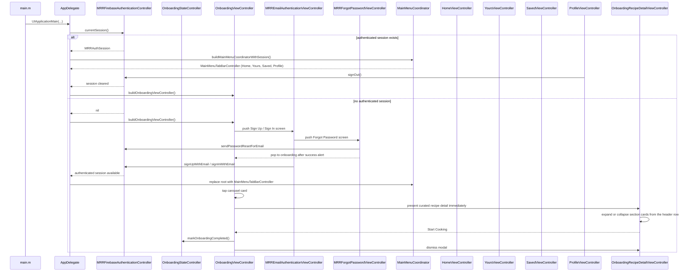
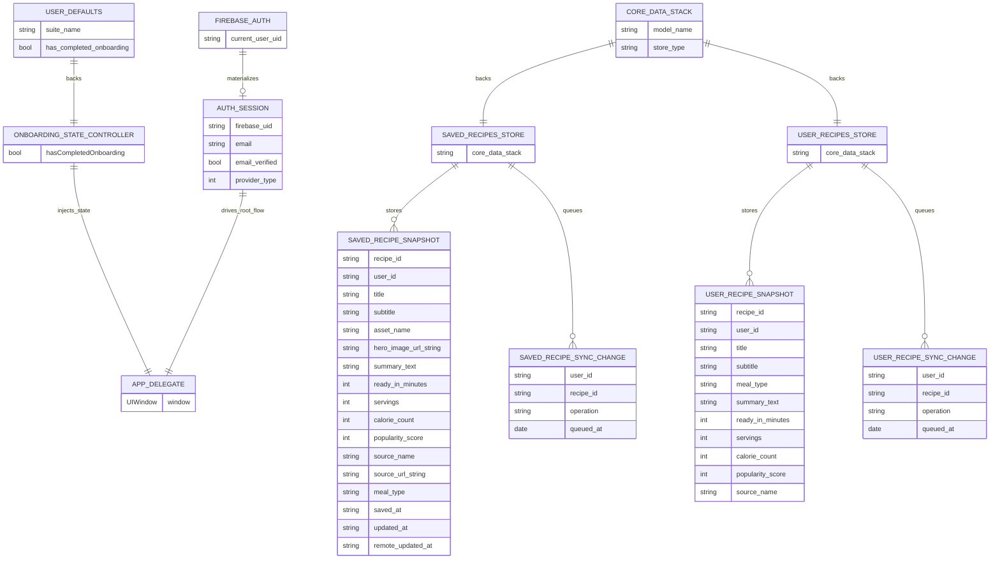
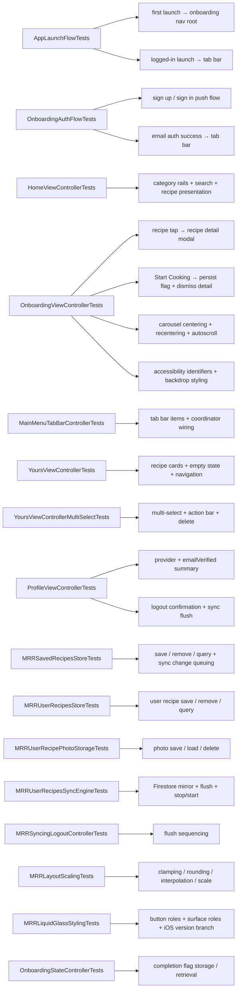

# Architecture Analysis

## Scope

This document reflects the current application after the old `MainMenu` screen was replaced by a coordinator-driven tab bar shell, the onboarding flow evolved into an email-first authentication entry point with a curated local recipe-detail step layered into onboarding, and authenticated users land on a `MainMenuTabBarController` with Home, Yours, Saved, and Profile tabs.

The user-facing runtime now contains these main surfaces:

- `OnboardingViewController` as the logged-out root
- `MRREmailAuthenticationViewController` pushed in either `Sign Up` or `Sign In` mode
- `MRRForgotPasswordViewController` pushed from the sign-in screen
- `OnboardingRecipeDetailViewController` as a modal recipe-exploration step for curated local recipe detail
- `MainMenuTabBarController` as the authenticated root, orchestrated by `MainMenuCoordinator`
  - **Home** tab: `HomeCoordinator` → `HomeViewController` (recipe browsing, search, categories)
  - **Yours** tab: `YoursCoordinator` → `YoursViewController` (user-created recipes, editor, photo picker, context menu)
  - **Saved** tab: `SavedCoordinator` → `SavedViewController` (bookmarked recipes with iCloud sync)
  - **Profile** tab: `ProfileCoordinator` → `ProfileViewController` (session summary, logout)

The app shell also owns shared infrastructure:

- `Resources/Assets.xcassets` for `AppIcon`, `OnboardingAppIcon`, named colors, and onboarding recipe imagery
- `Resources/GoogleService-Info.example.plist` as the tracked Firebase template, while the real Firebase plist stays local and is copied into the bundle at build time
- `Resources/RecipeAPIConfig.example.plist` as the tracked shared recipe API template, while real local recipe API config can stay outside git and still be copied into the bundle at build time
- `Layout/MRRLayoutScaling` and `Layout/MRRLiquidGlassStyling` for shared adaptive layout and Liquid Glass styling utilities
- `Persistence/CoreData/MRRCoreDataStack` for the Core Data persistence layer backing both Saved Recipes and User Recipes stores

## Executive Summary

The application is a state-aware iOS app with a polished onboarding surface, a Firebase-backed authentication session, a retained recipe-exploration flow built from curated local recipe content, and a fully wired authenticated home composed of four tab-bar feature coordinators.

`AppDelegate` is the composition root. On launch, it configures Firebase when possible, asks the authentication controller for a current session, and installs either the onboarding navigation stack or the `MainMenuCoordinator`-driven tab bar as the window root. Firebase configuration is loaded only if a local ignored `GoogleService-Info` file has been copied into the bundle by the build phase. `OnboardingViewController` owns the branded onboarding UI, looping carousel, auth CTA entry points, and recipe-detail presentation. When a carousel card is tapped, onboarding presents the curated local recipe detail immediately. The detail view renders `Ingredients`, `Methods`, `Tools & Equipment`, and `Tags` as collapsible cards that can be toggled from the header row or the chevron control. Its email CTAs push `MRREmailAuthenticationViewController`, which handles separate full-screen sign-up and sign-in layouts while keeping that UI under the onboarding feature. The sign-in flow can push `MRRForgotPasswordViewController` for Firebase reset-email handling. Upon successful authentication, `AppDelegate` observes the auth state and replaces the root with a `MainMenuCoordinator`-driven `MainMenuTabBarController`.

`OnboardingStateController` still persists whether the recipe flow reached `Start Cooking`, but that flag is now separate from launch routing. The root flow is driven by the auth session instead, observed via `MRRAuthStateObservation`.

The authenticated tab bar is assembled by `MainMenuCoordinator`, which wires each tab's coordinator with the session, stores, and sync engines:

- **HomeCoordinator** owns `HomeViewController` with `HomeDataSource`, `HomeCollectionViewCells`, `HomeSectionHeaderView`, and `HomeRecipeListViewController`. Home displays category-filtered recipe rails, a recommendation section, a weekly section, and live search with debouncing.
- **YoursCoordinator** owns `YoursViewController` with `MRRYoursRecipeEditorViewController` (full recipe editor with photo picker), `MRRImagePopupViewController` (pinch-to-zoom image viewer), and `MRRRecipeCardContextMenuViewController` (animated context menu with spring physics). Yours manages user-created recipes backed by `MRRUserRecipesStore` with `MRRUserRecipesSyncEngine` for Firestore sync.
- **SavedCoordinator** owns `SavedViewController`, presenting bookmarked recipes backed by `MRRSavedRecipesStore` with `MRRSavedRecipesSyncEngine` for Firestore sync.
- **ProfileCoordinator** owns `ProfileViewController`, showing provider, email, `emailVerified`, and logout confirmation with `MRRSyncingLogoutController` for logout-safe sync flush.

Each coordinator conforms to `MRRFeatureCoordinator` (or `MRRTabFeatureCoordinator` for tab items), and coordinators own their view controller's lifecycle via manual retain-release.

## Top-Level Module Map

```mermaid
flowchart TB
  main["App/main.m<br/>manual NSAutoreleasePool + UIApplicationMain"]
  plist["Resources/Info.plist"]
  firebaseTemplate["Resources/GoogleService-Info.example.plist"]
  buildPhase["App target build phase<br/>copies local GoogleService-Info into bundle"]
  assets["Resources/Assets.xcassets"]
  app["App/AppDelegate<br/>composition root + root flow + auth observer"]
  auth["Features/Authentication/MRRFirebaseAuthenticationController"]
  session["Features/Authentication/MRRAuthSession"]
  errorMapper["Features/Authentication/MRRAuthErrorMapper"]
  onboardingState["Features/Onboarding/Data/OnboardingStateController"]
  recipeCatalog["Features/Onboarding/Data/OnboardingRecipeCatalog"]
  recipeModels["Features/Onboarding/Data/OnboardingRecipeModels"]
  onboardingVC["Features/Onboarding/Presentation/ViewControllers/OnboardingViewController"]
  emailAuthVC["Features/Onboarding/Presentation/ViewControllers/MRREmailAuthenticationViewController"]
  forgotPasswordVC["Features/Onboarding/Presentation/ViewControllers/MRRForgotPasswordViewController"]
  onboardingDetailVC["Features/Onboarding/Presentation/ViewControllers/OnboardingRecipeDetailViewController"]
  carouselCell["Features/Onboarding/Presentation/Views/OnboardingRecipeCarouselCell"]
  coordinatorProto["Features/MainMenu/MRRFeatureCoordinator"]
  mainMenuCoord["Features/MainMenu/MainMenuCoordinator"]
  tabBarController["Features/MainMenu/MainMenuTabBarController"]
  homeCoord["Features/Home/HomeCoordinator"]
  homeVC["Features/Home/HomeViewController"]
  homeDataSource["Features/Home/HomeDataSource"]
  homeCells["Features/Home/HomeCollectionViewCells"]
  homeSectionHeader["Features/Home/HomeSectionHeaderView"]
  homeRecipeList["Features/Home/HomeRecipeListViewController"]
  yoursCoord["Features/Yours/YoursCoordinator"]
  yoursVC["Features/Yours/YoursViewController"]
  yoursEditor["Features/Yours/MRRYoursRecipeEditorViewController"]
  yoursImagePopup["Features/Yours/MRRImagePopupViewController"]
  yoursContextMenu["Features/Yours/MRRRecipeCardContextMenuViewController"]
  savedCoord["Features/Saved/SavedCoordinator"]
  savedVC["Features/Saved/SavedViewController"]
  profileCoord["Features/Profile/ProfileCoordinator"]
  profileVC["Features/Profile/ProfileViewController"]
  layoutScaling["Layout/MRRLayoutScaling"]
  liquidGlass["Layout/MRRLiquidGlassStyling"]
  coreDataStack["Persistence/CoreData/MRRCoreDataStack"]
  savedStore["Persistence/SavedRecipes/MRRSavedRecipesStore"]
  savedSyncEngine["Persistence/SavedRecipes/Sync/MRRSavedRecipesSyncEngine"]
  noOpSavedSync["Persistence/SavedRecipes/Sync/MRRNoOpSavedRecipesSyncEngine"]
  syncingLogout["Persistence/SavedRecipes/Sync/MRRSyncingLogoutController"]
  userStore["Persistence/UserRecipes/MRRUserRecipesStore"]
  userPhotoStorage["Persistence/UserRecipes/MRRUserRecipePhotoStorage"]
  userSyncEngine["Persistence/UserRecipes/Sync/MRRUserRecipesSyncEngine"]
  noOpUserSync["Persistence/UserRecipes/Sync/MRRNoOpUserRecipesSyncEngine"]
  tests["MRR ProjectTests"]

  main --> app
  plist --> app
  firebaseTemplate --> buildPhase
  buildPhase --> auth
  plist --> auth
  assets --> onboardingVC
  assets --> emailAuthVC
  assets --> onboardingDetailVC
  assets --> carouselCell
  assets --> homeVC
  assets --> homeCells
  assets --> yoursVC
  app --> auth
  auth --> session
  app --> onboardingState
  app --> onboardingVC
  app --> mainMenuCoord
  mainMenuCoord --> homeCoord
  mainMenuCoord --> yoursCoord
  mainMenuCoord --> savedCoord
  mainMenuCoord --> profileCoord
  mainMenuCoord --> tabBarController
  homeCoord --> homeVC
  homeVC --> homeDataSource
  homeVC --> homeCells
  homeVC --> homeSectionHeader
  homeVC --> homeRecipeList
  yoursCoord --> yoursVC
  yoursVC --> yoursEditor
  yoursVC --> yoursImagePopup
  yoursVC --> yoursContextMenu
  savedCoord --> savedVC
  profileCoord --> profileVC
  onboardingVC --> onboardingState
  onboardingVC --> emailAuthVC
  emailAuthVC --> forgotPasswordVC
  onboardingVC --> onboardingDetailVC
  onboardingVC --> carouselCell
  onboardingDetailVC --> recipeCatalog
  onboardingDetailVC --> recipeModels
  homeVC --> layoutScaling
  homeVC --> liquidGlass
  yoursVC --> liquidGlass
  profileVC --> liquidGlass
  profileVC --> errorMapper
  mainMenuCoord --> coreDataStack
  mainMenuCoord --> savedStore
  mainMenuCoord --> savedSyncEngine
  mainMenuCoord --> syncingLogout
  mainMenuCoord --> userStore
  mainMenuCoord --> userSyncEngine
  homeVC --> savedStore
  homeVC --> savedSyncEngine
  savedVC --> savedStore
  savedVC --> savedSyncEngine
  yoursVC --> userStore
  yoursVC --> userSyncEngine
  yoursVC --> userPhotoStorage
  profileVC --> auth
  profileVC --> syncingLogout
  tests -.verifies.-> app
  tests -.verifies.-> onboardingVC
  tests -.verifies.-> emailAuthVC
  tests -.verifies.-> homeVC
  tests -.verifies.-> onboardingDetailVC
  tests -.verifies.-> mainMenuCoord
  tests -.verifies.-> savedStore
  tests -.verifies.-> userStore
  tests -.verifies.-> syncingLogout
  tests -.verifies.-> layoutScaling
  tests -.verifies.-> liquidGlass
```



## Runtime Flow



## Root Composition Graph

```mermaid
flowchart TB
  app["AppDelegate"]
  window["UIWindow"]
  auth["MRRFirebaseAuthenticationController"]
  session["MRRAuthSession"]
  state["OnboardingStateController"]
  nav["UINavigationController (hidden bar)"]
  onboarding["OnboardingViewController"]
  email["MRREmailAuthenticationViewController"]
  reset["MRRForgotPasswordViewController"]
  detail["OnboardingRecipeDetailViewController"]
  menuCoord["MainMenuCoordinator"]
  tabBar["MainMenuTabBarController"]
  homeCoord["HomeCoordinator"]
  yoursCoord["YoursCoordinator"]
  savedCoord["SavedCoordinator"]
  profileCoord["ProfileCoordinator"]
  homeVC["HomeViewController"]
  yoursVC["YoursViewController"]
  savedVC["SavedViewController"]
  profileVC["ProfileViewController"]
  coreDataStack["MRRCoreDataStack"]
  savedStore["MRRSavedRecipesStore"]
  savedSyncEngine["MRRSavedRecipesSyncEngine"]
  userStore["MRRUserRecipesStore"]
  userSyncEngine["MRRUserRecipesSyncEngine"]
  syncingLogout["MRRSyncingLogoutController"]
  defaults["NSUserDefaults"]
  firebase["FirebaseAuth currentUser"]

  app --> window
  app --> auth
  app --> state
  app --> nav
  app --> menuCoord
  state --> defaults
  auth --> firebase
  auth --> session
  auth --> menuCoord
  nav --> onboarding
  onboarding --> state
  onboarding --> email
  email --> reset
  onboarding --> detail
  menuCoord --> tabBar
  menuCoord --> homeCoord
  menuCoord --> yoursCoord
  menuCoord --> savedCoord
  menuCoord --> profileCoord
  menuCoord --> coreDataStack
  menuCoord --> savedStore
  menuCoord --> savedSyncEngine
  menuCoord --> userStore
  menuCoord --> userSyncEngine
  menuCoord --> syncingLogout
  homeCoord --> homeVC
  yoursCoord --> yoursVC
  savedCoord --> savedVC
  profileCoord --> profileVC
  homeVC --> savedStore
  homeVC --> savedSyncEngine
  savedVC --> savedStore
  savedVC --> savedSyncEngine
  yoursVC --> userStore
  yoursVC --> userSyncEngine
  profileVC --> auth
  profileVC --> syncingLogout
```



## Persistence ERD



## Object Relationship Diagram

```mermaid
classDiagram
  class AppDelegate {
    +window
    +application:didFinishLaunchingWithOptions:
  }

  class MRRFirebaseAuthenticationController {
    +currentSession()
    +signUpWithEmail()
    +signInWithEmail()
    +signOut()
    +observeAuthState()
  }

  class MRRAuthSession {
    +email
    +providerType
    +emailVerified
  }

  class MRRAuthErrorMapper {
    +mapErrorToUserMessage()
  }

  class OnboardingStateController {
    +hasCompletedOnboarding()
    +markOnboardingCompleted()
  }

  class OnboardingViewController
  class RecipeSearchLoader

  class MRREmailAuthenticationViewController

  class HomeViewController

  class HomeDataSource {
    +HomeDataProviding protocol
    +HomeCompositeDataProvider
  }

  class OnboardingRecipeDetailViewController

  class MainMenuCoordinator {
    +rootViewController()
  }

  class MainMenuTabBarController

  class HomeCoordinator {
    +rootViewController()
    +tabBarItem()
  }

  class YoursCoordinator {
    +rootViewController()
    +tabBarItem()
  }

  class SavedCoordinator {
    +rootViewController()
    +tabBarItem()
  }

  class ProfileCoordinator {
    +rootViewController()
    +tabBarItem()
  }

  class MRRCoreDataStack {
    +persistentContainer
    +viewContext
    +newBackgroundContext()
  }

  class MRRSavedRecipesStore {
    +savedRecipesForUserID:error:
    +saveRecipeSnapshot:error:
    +removeRecipeForUserID:recipeID:error:
    +pendingSyncChangesForUserID:error:
    +applyRemoteSnapshot:error:
    +applyRemoteDeletionForUserID:error:
  }

  class MRRSavedRecipesSyncEngine {
    +startSyncForUserID:completion:
    +stopSync()
    +flushPendingChangesForUserID:completion:
  }

  class MRRUserRecipesStore {
    +userRecipesForUserID:error:
    +saveRecipeSnapshot:error:
    +removeRecipeForUserID:recipeID:error:
  }

  class MRRUserRecipesSyncEngine {
    +startSyncForUserID:completion:
    +stopSync()
  }

  class MRRUserRecipePhotoStorage

  class MRRSyncingLogoutController {
    +flushAndWaitForCompletion()
  }

  class MRRLiquidGlassStyling {
    +supportsNativeLiquidGlass()
    +applyButtonRole:toButton:
    +applySurfaceRole:toView:
    +applyTextFieldStyling:
  }

  class MRRLayoutScaling {
    +MRRLayoutScaledValue()
    +MRRLayoutScaleFactor()
  }

  AppDelegate --> MRRFirebaseAuthenticationController
  MRRFirebaseAuthenticationController --> MRRAuthSession
  AppDelegate --> OnboardingStateController
  AppDelegate --> OnboardingViewController
  AppDelegate --> MainMenuCoordinator
  MainMenuCoordinator --> MainMenuTabBarController
  MainMenuCoordinator --> HomeCoordinator
  MainMenuCoordinator --> YoursCoordinator
  MainMenuCoordinator --> SavedCoordinator
  MainMenuCoordinator --> ProfileCoordinator
  HomeCoordinator --> HomeViewController
  HomeViewController --> HomeDataSource
  YoursCoordinator --> YoursViewController
  SavedCoordinator --> SavedViewController
  ProfileCoordinator --> ProfileViewController
  OnboardingViewController --> OnboardingStateController
  OnboardingViewController --> MRREmailAuthenticationViewController
  OnboardingViewController --> OnboardingRecipeDetailViewController
  OnboardingViewController --> RecipeSearchLoader
  RecipeSearchLoader --> OnboardingRecipeDetailViewController
  HomeViewController --> MRRSavedRecipesStore
  HomeViewController --> MRRLiquidGlassStyling
  YoursViewController --> MRRUserRecipesStore
  YoursViewController --> MRRUserRecipesSyncEngine
  ProfileViewController --> MRRAuthErrorMapper
  ProfileViewController --> MRRSyncingLogoutController
  MainMenuCoordinator --> MRRCoreDataStack
  MainMenuCoordinator --> MRRSavedRecipesStore
  MainMenuCoordinator --> MRRSavedRecipesSyncEngine
  MainMenuCoordinator --> MRRUserRecipesStore
  MainMenuCoordinator --> MRRUserRecipesSyncEngine
  MainMenuCoordinator --> MRRSyncingLogoutController
```



## File Responsibilities

| File | Responsibility | Key relationship |
| --- | --- | --- |
| `MRR Project/App/main.m` | Application bootstrap with manual autorelease pool | Starts UIKit lifecycle |
| `MRR Project/App/AppDelegate.h` | Public app delegate contract | Exposes injectable initializer for tests |
| `MRR Project/App/AppDelegate.m` | Composition root, root-controller installation, auth state observation | Chooses onboarding navigation stack or tab bar based on the current auth session |
| `MRR Project/Resources/Info.plist` | Application metadata and launch configuration | Referenced directly by build settings |
| `MRR Project/Resources/Assets.xcassets` | Shared app icon, named colors, and onboarding/recipe imagery | Used by programmatic UI across all features |
| `MRR Project/Resources/GoogleService-Info.example.plist` | Tracked Firebase config template | Real file copied at build time |
| `MRR Project/Resources/RecipeAPIConfig.example.plist` | Tracked recipe API config template | Real file copied at build time |
| `MRR Project/Features/Authentication/MRRAuthenticationController.h` | Auth abstraction used by the app shell and tests | Keeps Firebase behind a mockable interface |
| `MRR Project/Features/Authentication/MRRFirebaseAuthenticationController.h/.m` | Firebase-backed auth implementation | Builds `MRRAuthSession` from `FIRAuth` and handles email/Google auth actions; observes auth state changes |
| `MRR Project/Features/Authentication/MRRAuthSession.h/.m` | Immutable auth-session value object | Carries `email`, provider, and `emailVerified` into the UI |
| `MRR Project/Features/Authentication/MRRAuthErrorMapper.h/.m` | Maps auth errors into user-facing copy | Shared by onboarding auth and profile logout errors |
| `MRR Project/Features/Onboarding/Data/OnboardingStateController.h/.m` | Stores onboarding recipe completion in `NSUserDefaults` | Legacy onboarding state kept separate from auth-based root flow |
| `MRR Project/Features/Onboarding/Data/OnboardingRecipeCatalog.h/.m` | Curated local recipe catalog for onboarding carousel | Provides recipe data for the onboarding carousel cards |
| `MRR Project/Features/Onboarding/Data/OnboardingRecipeModels.h/.m` | Onboarding recipe data model objects | Shared value types for recipe detail across onboarding and home |
| `MRR Project/Features/Onboarding/Presentation/ViewControllers/OnboardingViewController.h/.m` | Builds branded onboarding layout, looping carousel, auth CTA entry points, and recipe-detail flow | Owns push-based email auth navigation and launch centering safeguards |
| `MRR Project/Features/Onboarding/Presentation/ViewControllers/MRREmailAuthenticationViewController.h/.m` | Renders full-screen sign-up and sign-in screens | Handles email/password validation, keyboard-aware scrolling, and auth submission |
| `MRR Project/Features/Onboarding/Presentation/ViewControllers/MRRForgotPasswordViewController.h/.m` | Renders the dedicated password-reset screen | Validates reset email input, calls the auth controller reset API, and returns to onboarding after success confirmation |
| `MRR Project/Features/Onboarding/Presentation/ViewControllers/OnboardingRecipeDetailViewController.h/.m` | Renders modal recipe detail content | Supports skeleton loading and then hydrates live or curated detail before triggering onboarding completion |
| `MRR Project/Features/Onboarding/Presentation/Views/OnboardingRecipeCarouselCell.h/.m` | Renders adaptive recipe cards, shared backdrop styling, and fade mask blending | Provides stable accessibility identifiers per recipe and the visual anchor for the carousel |
| `MRR Project/Features/MainMenu/MRRFeatureCoordinator.h` | Coordinator protocol (`MRRFeatureCoordinator` + `MRRTabFeatureCoordinator`) | Decouples coordinator interface from concrete types |
| `MRR Project/Features/MainMenu/MainMenuCoordinator.h/.m` | Assembles the authenticated tab bar root | Wires Home, Yours, Saved, Profile coordinators with session, stores, and sync engines |
| `MRR Project/Features/MainMenu/MainMenuTabBarController.h/.m` | Styled `UITabBarController` with named-color theming and dynamic appearance | The authenticated root view controller |
| `MRR Project/Features/Home/HomeCoordinator.h/.m` | Home tab coordinator | Builds `HomeViewController` with session, data provider, saved-recipes store, and sync engine |
| `MRR Project/Features/Home/HomeViewController.h/.m` | Renders the authenticated home screen with category rails, recommendations, weekly section, and live search | Delegates save/unsave to `MRRSavedRecipesStore`, presents recipe detail from results |
| `MRR Project/Features/Home/HomeDataSource.h/.m` | Data provider abstraction and composite data source for home sections | `HomeDataProviding` protocol + `HomeCompositeDataProvider` merging local catalog with remote API |
| `MRR Project/Features/Home/HomeCollectionViewCells.h/.m` | `HomeCategoryCell` and `HomeRecipeCardCell` collection view cells | Provides rail and list cell styles with named-color theming and image caching |
| `MRR Project/Features/Home/HomeSectionHeaderView.h/.m` | Section header with title label and "See All" button | Used by `HomeViewController` collection view compositional layout |
| `MRR Project/Features/Home/HomeRecipeListViewController.h/.m` | Pushable recipe list screen for "See All" actions | Shows search results or category recipes in a vertical list |
| `MRR Project/Features/Yours/YoursCoordinator.h/.m` | Yours tab coordinator | Builds `YoursViewController` with session, user recipes store, and sync engine |
| `MRR Project/Features/Yours/YoursViewController.h/.m` | Renders user-created recipes collection with multi-select, card context menus, and empty-state messaging | Backed by `MRRUserRecipesStore` with `MRRUserRecipesSyncEngine` |
| `MRR Project/Features/Yours/MRRYoursRecipeEditorViewController.h/.m` | Full recipe editor with photo picker (PHPickerViewController), text fields, and validation | Creates/edits `MRRUserRecipeSnapshot` and syncs changes |
| `MRR Project/Features/Yours/MRRImagePopupViewController.h/.m` | Pinch-to-zoom image viewer with dimming backdrop | Presented from recipe cards and editor |
| `MRR Project/Features/Yours/MRRRecipeCardContextMenuViewController.h/.m` | Animated context menu with spring physics, staggered item animations, and haptic feedback | Provides edit/delete/duplicate actions on recipe cards |
| `MRR Project/Features/Saved/SavedCoordinator.h/.m` | Saved tab coordinator | Builds `SavedViewController` with saved-recipes store and sync engine |
| `MRR Project/Features/Saved/SavedViewController.h/.m` | Renders bookmarked recipes collection with empty-state messaging | Backed by `MRRSavedRecipesStore` with `MRRSavedRecipesSyncEngine` |
| `MRR Project/Features/Profile/ProfileCoordinator.h/.m` | Profile tab coordinator | Builds `ProfileViewController` with auth controller and logout coordination |
| `MRR Project/Features/Profile/ProfileViewController.h/.m` | Renders session summary (provider, email, emailVerified) and logout confirmation with sync flush | Delegates sign-out back to auth controller via `MRRSyncingLogoutController` |
| `MRR Project/Layout/MRRLayoutScaling.h/.m` | Viewport-adaptive layout scaling utilities | Provides `MRRLayoutScaledValue`, `MRRLayoutScaleFactor` based on iPhone 15 Pro base dimensions |
| `MRR Project/Layout/MRRLiquidGlassStyling.h/.m` | Cross-version Liquid Glass styling fallback | Uses iOS 26 native `UIButtonConfiguration` glass APIs when available, falls back to opaque styled buttons on earlier versions |
| `MRR Project/Persistence/CoreData/MRRCoreDataStack.h/.m` | Core Data stack wrapper with in-memory and SQLite store support | Shared persistent container for Saved Recipes and User Recipes stores |
| `MRR Project/Persistence/SavedRecipes/MRRSavedRecipesStore.h/.m` | CRUD operations for saved recipes via Core Data | Manages `SavedRecipe`, `SavedRecipeIngredient`, `SavedRecipeInstruction`, `SavedRecipeTool`, `SavedRecipeTag` entities |
| `MRR Project/Persistence/SavedRecipes/Sync/MRRSavedRecipesCloudSyncing.h` | Saved recipes sync protocol | `startSyncForUserID:`, `stopSync`, `flushPendingChangesForUserID:`, `requestImmediateSyncForUserID:` |
| `MRR Project/Persistence/SavedRecipes/Sync/MRRSavedRecipesSyncEngine.h/.m` | Firestore-backed sync engine for saved recipes | Observes Firestore collections, applies remote changes, queues pending sync changes |
| `MRR Project/Persistence/SavedRecipes/Sync/MRRNoOpSavedRecipesSyncEngine.h/.m` | No-op sync engine for unauthenticated or offline use | Conforms to `MRRSavedRecipesCloudSyncing` with empty implementations |
| `MRR Project/Persistence/SavedRecipes/Sync/MRRSyncingLogoutController.h/.m` | Coordinates sync flush before logout | Ensures pending changes are flushed before sign-out completes |
| `MRR Project/Persistence/SavedRecipes/Models/MRRSavedRecipeSnapshot.h/.m` | Immutable value objects for saved recipe data | `MRRSavedRecipeSnapshot` with nested `Ingredient`, `Instruction`, `Tool`, `Tag` snapshots |
| `MRR Project/Persistence/SavedRecipes/Models/MRRSavedRecipeSyncChange.h/.m` | Queued sync change model for saved recipes | Tracks `upsert`/`delete` operations with `queuedAt` timestamp |
| `MRR Project/Persistence/UserRecipes/MRRUserRecipesStore.h/.m` | CRUD operations for user-created recipes via Core Data | Manages `UserRecipe` entities with ingredients, instructions, tools, tags, and photos |
| `MRR Project/Persistence/UserRecipes/MRRUserRecipePhotoStorage.h/.m` | Local file storage for user recipe photos | Manages photo save/load/delete in the app's documents directory |
| `MRR Project/Persistence/UserRecipes/Sync/MRRUserRecipesCloudSyncing.h` | User recipes sync protocol | Same interface shape as `MRRSavedRecipesCloudSyncing` |
| `MRR Project/Persistence/UserRecipes/Sync/MRRUserRecipesSyncEngine.h/.m` | Firestore-backed sync engine for user recipes | Mirrors saved-recipes sync pattern with user-recipes Firestore collections |
| `MRR Project/Persistence/UserRecipes/Sync/MRRNoOpUserRecipesSyncEngine.h/.m` | No-op sync engine for unauthenticated or offline use | Conforms to `MRRUserRecipesCloudSyncing` with empty implementations |
| `MRR Project/Persistence/UserRecipes/Models/MRRUserRecipeSnapshot.h/.m` | Immutable value objects for user recipe data | `MRRUserRecipeSnapshot` with nested models, photo snapshots, and convenience constructors from `OnboardingRecipeDetail` |
| `MRR Project/Persistence/UserRecipes/Models/MRRUserRecipeSyncChange.h/.m` | Queued sync change model for user recipes | Tracks `upsert`/`delete` operations with `queuedAt` timestamp |
| `MRR ProjectTests/AppLaunchFlowTests.m` | Verifies launch-state behavior | Covers onboarding/tab-bar root routing and sign-out transitions |
| `MRR ProjectTests/OnboardingAuthFlowTests.m` | Verifies pushed auth-screen behavior | Covers sign-up/sign-in entry, keyboard-aware layout, and auth success transitions |
| `MRR ProjectTests/HomeViewControllerTests.m` | Verifies home summary and interaction patterns | Covers accessibility identifiers, category selection, search, and recipe presentation |
| `MRR ProjectTests/OnboardingViewControllerTests.m` | Verifies onboarding layout, carousel behavior, detail presentation, and accessibility | Covers centering, recentering, backdrop styling, and completion flow |
| `MRR ProjectTests/MainMenuTabBarControllerTests.m` | Verifies tab bar controller assembly and coordinator wiring | Covers tab items, coordinator root view controllers, and appearance |
| `MRR ProjectTests/ProfileViewControllerTests.m` | Verifies profile session display and logout | Covers email verification label, provider display, logout confirmation, and sync flush coordination |
| `MRR ProjectTests/YoursViewControllerTests.m` | Verifies yours recipe listing and card interactions | Covers empty state, recipe card display, and navigation |
| `MRR ProjectTests/YoursViewControllerMultiSelectTests.m` | Verifies multi-select behavior on yours tab | Covers batch selection, action bar, and delete flow |
| `MRR ProjectTests/MRRLayoutScalingTests.m` | Verifies layout scaling utility functions | Covers clamping, rounding, interpolation, and scale factors |
| `MRR ProjectTests/MRRLiquidGlassStylingTests.m` | Verifies Liquid Glass styling fallbacks | Covers button role application, surface role application, and iOS version branching |
| `MRR ProjectTests/MRRSavedRecipesStoreTests.m` | Verifies saved recipes CRUD operations | Covers save, remove, query, and sync change queuing with in-memory Core Data |
| `MRR ProjectTests/MRRUserRecipesStoreTests.m` | Verifies user recipes CRUD operations | Covers save, remove, query, and snapshot conversion |
| `MRR ProjectTests/MRRUserRecipePhotoStorageTests.m` | Verifies photo storage save/load/delete | Covers file system operations for user recipe photos |
| `MRR ProjectTests/MRRUserRecipesSyncEngineTests.m` | Verifies user recipes sync engine | Covers Firestore mirror, pending change flushing, and stop/restart |
| `MRR ProjectTests/MRRSyncingLogoutControllerTests.m` | Verifies logout controller coordinates flush | Covers flush-before-logout sequencing |
| `MRR ProjectTests/OnboardingStateControllerTests.m` | Verifies onboarding state persistence | Covers completion flag storage and retrieval from NSUserDefaults |

## Active Dependencies

The runtime dependency chain is now organized around the coordinator pattern:

```
AppDelegate → MRRFirebaseAuthenticationController → FirebaseAuth currentUser
AppDelegate → OnboardingStateController → NSUserDefaults
AppDelegate → UINavigationController → OnboardingViewController → MRREmailAuthenticationViewController
MRREmailAuthenticationViewController → MRRForgotPasswordViewController
AppDelegate → MainMenuCoordinator → HomeCoordinator → HomeViewController
MainMenuCoordinator → YoursCoordinator → YoursViewController
MainMenuCoordinator → SavedCoordinator → SavedViewController
MainMenuCoordinator → ProfileCoordinator → ProfileViewController
MainMenuCoordinator → MRRCoreDataStack
MainMenuCoordinator → MRRSavedRecipesStore → MRRCoreDataStack
MainMenuCoordinator → MRRSavedRecipesSyncEngine → Firestore
MainMenuCoordinator → MRRUserRecipesStore → MRRCoreDataStack
MainMenuCoordinator → MRRUserRecipesSyncEngine → Firestore
MainMenuCoordinator → MRRSyncingLogoutController
HomeViewController → MRRSavedRecipesStore
HomeViewController → MRRSavedRecipesCloudSyncing
HomeViewController → OnboardingRecipeDetailViewController
YoursViewController → MRRUserRecipesStore
YoursViewController → MRRUserRecipesSyncEngine
YoursViewController → MRRUserRecipePhotoStorage
YoursViewController → MRRYoursRecipeEditorViewController
YoursViewController → MRRImagePopupViewController → MRRRecipeCardContextMenuViewController
SavedViewController → MRRSavedRecipesStore
SavedViewController → MRRSavedRecipesCloudSyncing
ProfileViewController → MRRAuthenticationController
ProfileViewController → MRRSyncingLogoutController
OnboardingViewController → OnboardingRecipeDetailViewController
OnboardingViewController → OnboardingRecipeCatalog
OnboardingViewController → OnboardingRecipeCarouselCell → UICollectionView
HomeViewController → HomeDataSource → HomeCompositeDataProvider → OnboardingRecipeCatalog
HomeViewController → HomeCollectionViewCells
HomeViewController → HomeSectionHeaderView
HomeViewController → HomeRecipeListViewController
HomeViewController → MRRLayoutScaling
HomeViewController → MRRLiquidGlassStyling
YoursViewController → MRRLiquidGlassStyling
ProfileViewController → MRRLiquidGlassStyling
MRRCoreDataStack → MRRProjectDataModel.xcdatamodeld
```

## Testing Coverage



## Architectural Notes

- The app target uses Manual Retain-Release. Application code must continue balancing retained objects explicitly.
- Root navigation is coordinator-based. `MainMenuCoordinator` assembles the tab bar and wires each tab coordinator with its dependencies. This replaced the previous direct `HomeViewController` root.
- The onboarding feature owns the dedicated sign-up and sign-in screens, so auth entry remains visually and structurally close to the onboarding surface.
- The forgot-password flow is also owned by onboarding and reuses the same authentication abstraction instead of adding a separate coordinator.
- Email/password and Google Sign-In are live onboarding auth paths. Apple stays visible as a structured stub.
- The onboarding carousel uses virtual looping plus guarded initial positioning so auto-scroll does not jump on launch.
- The auth screens are keyboard-aware: they use scroll insets, tap-to-dismiss, and focused-field visibility handling.
- Light and dark appearance rely on named colors from the shared asset catalog, with `MRRDynamicFallbackColor` helpers for iOS 12 compatibility.
- `MRRLiquidGlassStyling` provides a unified styling layer that uses native `UIButtonConfiguration` glass APIs on iOS 26+ and falls back to opaque styled buttons on earlier versions.
- `MRRLayoutScaling` provides viewport-adaptive layout scaling with a base of iPhone 15 Pro dimensions (390×844).
- Accessibility identifiers are a maintained part of the onboarding, auth, home, yours, saved, and profile debug/test contract.
- The Saved Recipes and User Recipes persistence layers both follow the same pattern: Core Data store, immutable snapshot models, sync change queuing, a Firestore-backed sync engine, a no-op fallback for unauthenticated use, and a logout controller that flushes pending changes before sign-out.
- `HomeDataSource` introduces a `HomeDataProviding` protocol and `HomeCompositeDataProvider` that merges local catalog data with remote API results, supporting category rails, recommendations, weekly picks, and debounced search.
- The `Yours` feature includes a full recipe editor (`MRRYoursRecipeEditorViewController`) with photo picker, text inputs, and validation; an image popup viewer (`MRRImagePopupViewController`); and an animated context menu (`MRRRecipeCardContextMenuViewController`).
- The repository includes a tracked GitHub Actions coverage workflow that uploads Cobertura coverage to Codecov on `main` via `CODECOV_TOKEN`, plus a tracked pre-commit hook for Objective-C formatting and linting.
- Any local `Packages/CocoaLumberjack/` checkout is outside the tracked runtime graph and ignored by git so CI does not treat it as a submodule.

## Conclusion

The current architecture is a coordinator-driven onboarding-and-auth application that transitions into a four-tab authenticated shell. `AppDelegate` remains the composition root and auth state observer, `OnboardingViewController` remains the logged-out entry surface, `MainMenuCoordinator` orchestrates the authenticated tab bar, and each tab coordinator (`HomeCoordinator`, `YoursCoordinator`, `SavedCoordinator`, `ProfileCoordinator`) owns its view controller lifecycle. The persistence layer uses Core Data with Firestore sync for both saved and user-created recipes. The result is a modular runtime surface with polished carousel, recipe editing and viewing, category-based browsing, search, adaptive theming, live email and Google auth, and a comprehensive test and tooling infrastructure.