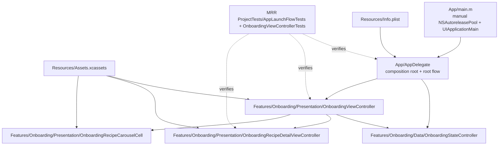
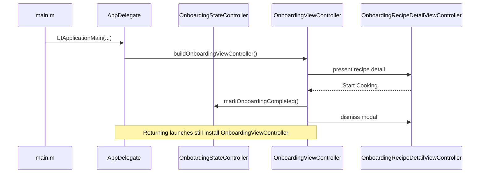
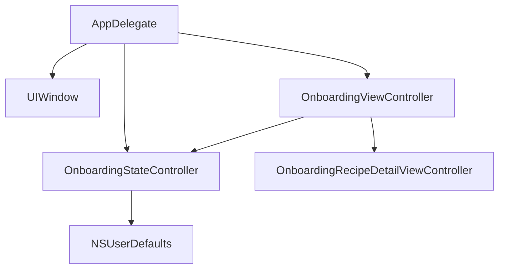
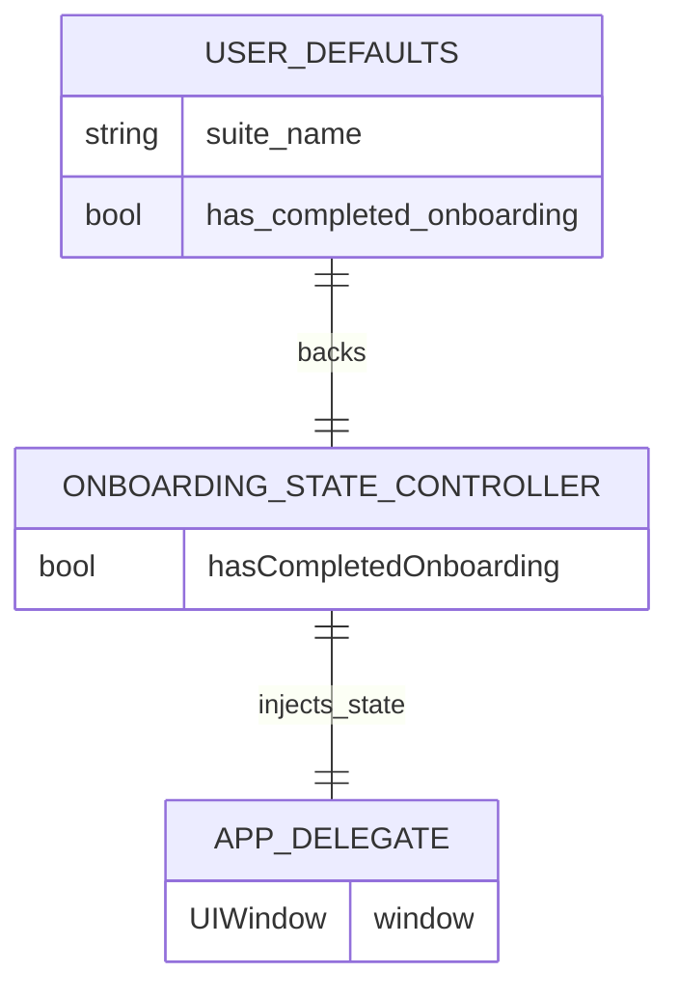
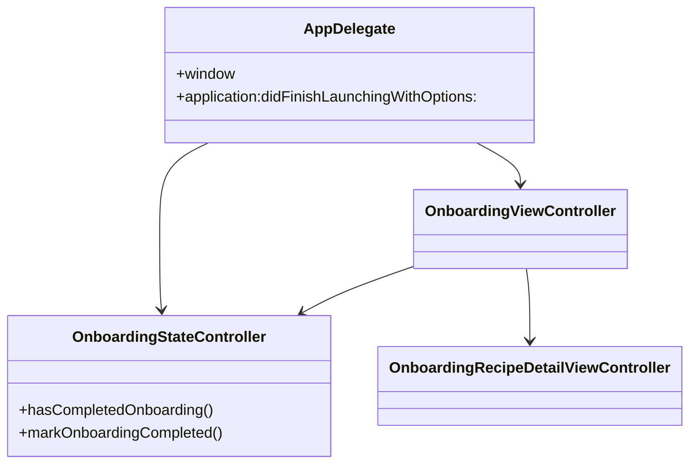
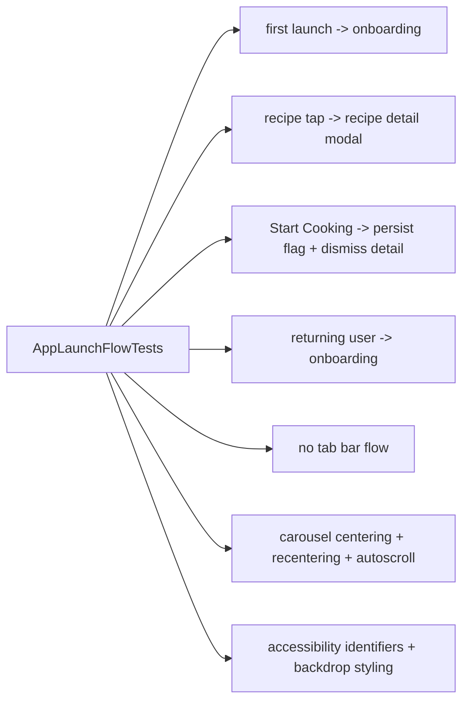

# Architecture Analysis

## Scope

This document reflects the current application after the old demo-learning stack and the standalone `MainMenu` screen have been removed from both the runtime flow and the repository.

The app now contains one primary user-facing screen plus one modal step:

- `OnboardingViewController` on every launch

- `OnboardingRecipeDetailViewController` for inspecting a recipe and completing onboarding through `Start Cooking`

The app shell also owns one asset catalog for shared visual resources:

- `Resources/Assets.xcassets` for `AppIcon`, `OnboardingAppIcon`, named colors, and onboarding recipe imagery

## Executive Summary

The application is a small state-aware iOS app centered on a polished onboarding surface and one persisted boolean that records whether the user has tapped `Start Cooking`.

`AppDelegate` is the composition root and now always installs `OnboardingViewController` as the window root. `OnboardingViewController` owns the branded onboarding UI, looping carousel, auth CTA placeholders, and the completion persistence flow. It presents `OnboardingRecipeDetailViewController` when a recipe card is selected, and it writes onboarding completion directly through `OnboardingStateController` before dismissing the modal. Future launches continue using the onboarding root while retaining the stored completion flag.

## Top-Level Module Map

## Runtime Flow

## Root Composition Graph

## Persistence ERD

## Object Relationship Diagram

## File Responsibilities

| File | Responsibility | Key relationship |
| --- | --- | --- |
| `MRR Project/App/main.m` | Application bootstrap with manual autorelease pool | Starts UIKit lifecycle |
| `MRR Project/App/AppDelegate.h` | Public app delegate contract | Exposes injectable initializer for tests |
| `MRR Project/App/AppDelegate.m` | Composition root and root-controller installation | Injects shared onboarding state into the root controller |
| `MRR Project/Resources/Info.plist` | Application metadata and launch configuration | Referenced directly by build settings |
| `MRR Project/Resources/Assets.xcassets` | Shared app icon, named colors, and onboarding illustration | Used by the current programmatic UI |
| `MRR Project/Features/Onboarding/Data/OnboardingStateController.h` | Declares onboarding persistence API | Used by `AppDelegate` |
| `MRR Project/Features/Onboarding/Data/OnboardingStateController.m` | Stores onboarding completion in `NSUserDefaults` | Single source of persisted launch state |
| `MRR Project/Features/Onboarding/Presentation/ViewControllers/OnboardingViewController.h` | Declares the onboarding controller initializer | Accepts injected onboarding state |
| `MRR Project/Features/Onboarding/Presentation/ViewControllers/OnboardingViewController.m` | Builds branded onboarding layout, looping carousel, modal presentation flow, and completion persistence | Owns auto-scroll and launch centering safeguards |
| `MRR Project/Features/Onboarding/Presentation/ViewControllers/OnboardingRecipeDetailViewController.h` | Declares recipe-detail delegate callbacks | Reports close and `Start Cooking` actions |
| `MRR Project/Features/Onboarding/Presentation/ViewControllers/OnboardingRecipeDetailViewController.m` | Renders modal recipe detail content | Triggers onboarding completion through the onboarding controller |
| `MRR Project/Features/Onboarding/Presentation/Views/OnboardingRecipeCarouselCell.h` | Declares the onboarding carousel cell | Used by `OnboardingViewController` collection view |
| `MRR Project/Features/Onboarding/Presentation/Views/OnboardingRecipeCarouselCell.m` | Renders adaptive recipe cards, shared backdrop styling, and fade mask blending | Provides stable accessibility identifiers per recipe |
| `MRR ProjectTests/AppLaunchFlowTests.m` | Verifies launch-state behavior | Covers onboarding-only launch routing and persisted completion compatibility |
| `MRR ProjectTests/OnboardingViewControllerTests.m` | Verifies onboarding layout, carousel behavior, detail presentation, and accessibility | Covers centering, recentering, backdrop styling, and completion flow |

## Active Dependencies

The runtime dependency chain is intentionally small:

`AppDelegate -> OnboardingStateController -> NSUserDefaults`

`AppDelegate -> OnboardingViewController`

`OnboardingViewController -> UICollectionView -> OnboardingRecipeCarouselCell`

`OnboardingViewController -> OnboardingStateController`

`OnboardingViewController -> OnboardingRecipeDetailViewController`

`Assets.xcassets -> OnboardingViewController / OnboardingRecipeDetailViewController / OnboardingRecipeCarouselCell`

There is no tab bar, no feature repository graph, and no shared demo infrastructure anymore.

## Testing Coverage

## Architectural Notes

- The app target uses Manual Retain-Release. Application code must continue balancing retained objects explicitly.
- Navigation is state-based, not coordinator-based. This keeps the app small and direct.
- The onboarding carousel uses virtual looping plus guarded initial positioning so auto-scroll does not jump on launch.
- Light and dark appearance rely on named colors from the shared asset catalog.
- Accessibility identifiers are a maintained part of the onboarding debug and UI-test contract.
- The current repository is intentionally narrow: app shell, onboarding state, onboarding UI, and focused launch/onboarding tests.

## Conclusion

The current architecture is a minimal onboarding-focused application. `AppDelegate` remains the composition root, `OnboardingViewController` remains the primary screen, and `OnboardingStateController` continues persisting completion state without introducing a separate post-onboarding menu. The result is a narrower runtime surface with the same polished carousel, modal recipe detail flow, adaptive theming, and maintained test coverage.
