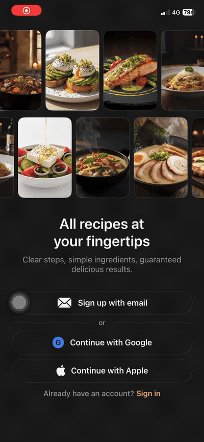
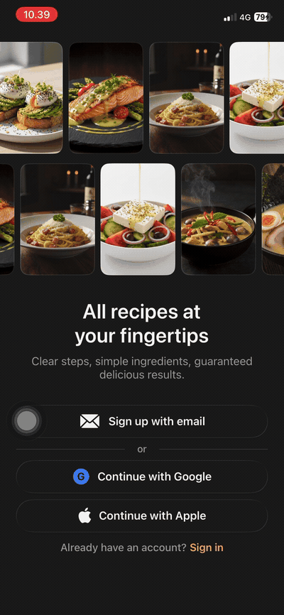
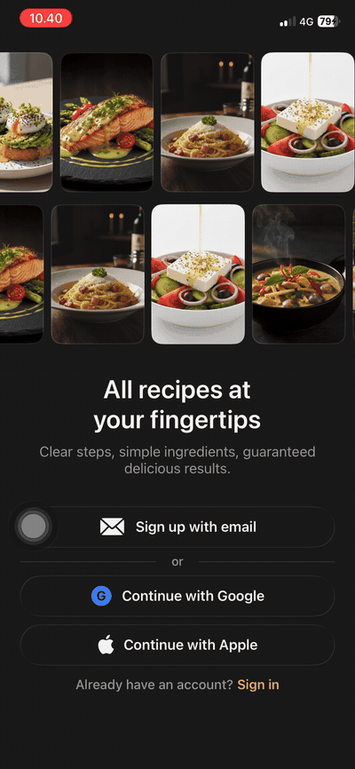
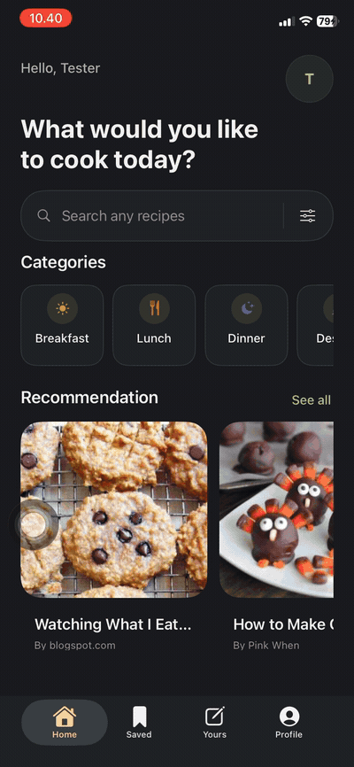
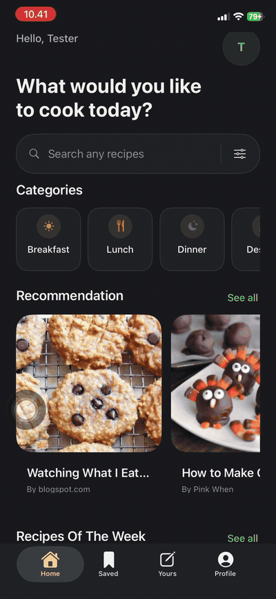
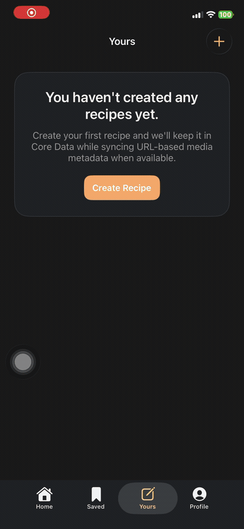
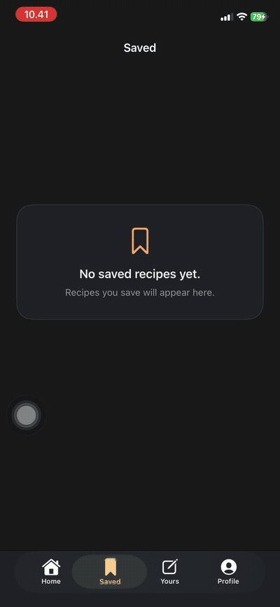
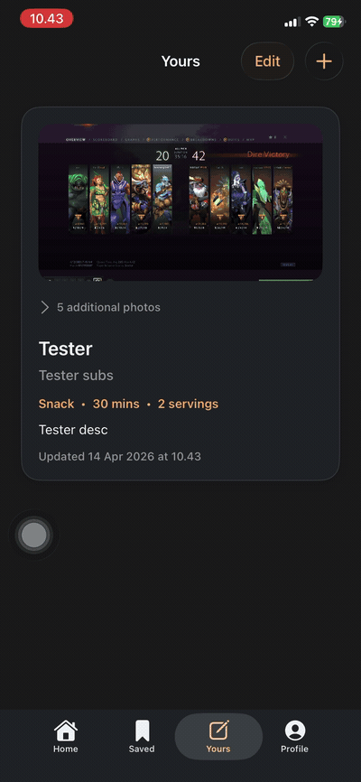
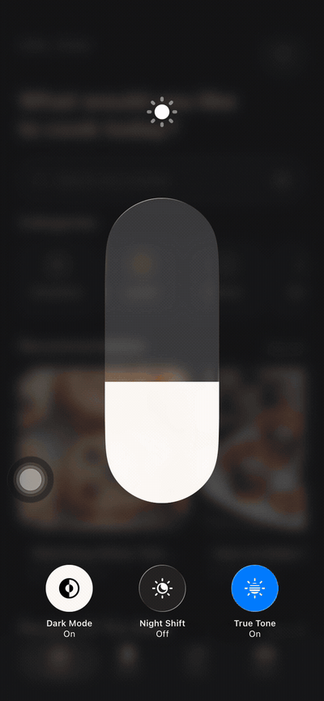

# iOS MRR Learning Project

[](https://github.com/bengidev/ios-mrr-experiment/actions/workflows/ios-tests-coverage.yml)
[](https://codecov.io/gh/bengidev/ios-mrr-experiment)


An Objective-C iOS project for studying Manual Retain-Release (MRR) with a polished onboarding flow, Firebase authentication, a coordinator-driven authenticated shell, and Firestore-backed recipe persistence.

## Feature Highlights

- **Firebase Authentication**
  Email/password sign up, sign in, password reset, session observation, and sign out are all wired through `MRRFirebaseAuthenticationController`.
- **Google Sign-In + Firebase**
  Google login is live from onboarding, including callback handling in `AppDelegate` and Firebase credential sign-in.
- **Account linking fallback**
  If a Google account collides with an existing email/password account, the app pushes a prefilled sign-in flow to finish linking the pending Firebase credential.
- **Auth-driven root navigation**
  `AppDelegate` observes Firebase auth state and automatically swaps between onboarding and the authenticated tab shell.
- **Coordinator-based main shell**
  Authenticated users land in a four-tab experience: `Home`, `Saved`, `Yours`, and `Profile`.
- **Home browsing experience**
  Browse recipes by category, see recommendation and weekly sections, run debounced search, apply filters, and open recipe detail from the home feed.
- **Saved recipes**
  Recipes can be bookmarked from detail screens, stored locally in Core Data, and synced to Firestore under the signed-in user.
- **Your recipes**
  Users can create, edit, and delete their own recipes, attach multiple photos from the photo library, preview images, and manage recipes in multi-select mode.
- **Sync-safe logout**
  Logout goes through `MRRSyncingLogoutController`, which flushes saved-recipe and user-recipe sync work before ending the Firebase session.
- **Polished UIKit UI**
  Fully programmatic UIKit screens, adaptive layout helpers, Liquid Glass styling, and named colors for dark/light appearance.

## Demo Videos

Animated previews for GitHub README. Click any preview to open the original `.MP4`.

<table>
  <tr>
    <td align="center" width="50%">
      <a href="videos/signup.MP4"></a><br />
      <strong>Sign Up</strong>
    </td>
    <td align="center" width="50%">
      <a href="videos/login.MP4"></a><br />
      <strong>Login</strong>
    </td>
  </tr>
  <tr>
    <td align="center" width="50%">
      <a href="videos/google_login.MP4"></a><br />
      <strong>Google Login</strong>
    </td>
    <td align="center" width="50%">
      <a href="videos/home.MP4"></a><br />
      <strong>Home</strong>
    </td>
  </tr>
  <tr>
    <td align="center" width="50%">
      <a href="videos/saved.MP4"></a><br />
      <strong>Saved</strong>
    </td>
    <td align="center" width="50%">
      <a href="videos/yours.MP4"></a><br />
      <strong>Yours</strong>
    </td>
  </tr>
  <tr>
    <td align="center" width="50%">
      <a href="videos/tabs.MP4"></a><br />
      <strong>Tabs</strong>
    </td>
    <td align="center" width="50%">
      <a href="videos/dynamic_photos.MP4"></a><br />
      <strong>Dynamic Photos</strong>
    </td>
  </tr>
  <tr>
    <td align="center" width="50%">
      <a href="videos/dark_light.MP4"></a><br />
      <strong>Dark / Light Mode</strong>
    </td>
    <td align="center" width="50%"></td>
  </tr>
</table>

## Current Flow

- Logged-out launch: show `OnboardingViewController` inside a hidden `UINavigationController`
- Onboarding displays the `Culina` brand header, app icon, looping recipe carousel, and auth entry points
- `Sign up with email` pushes a dedicated full-screen sign-up screen with separate fields for first name, last name, email, and password
- `Sign in` pushes a dedicated full-screen sign-in screen with email/password plus a live `Forgot Password?` flow that sends a Firebase reset email and returns to onboarding after confirmation
- `Continue with Google` starts live Google Sign-In from onboarding and signs into Firebase, while `Continue with Apple` remains a structured stub
- Google auth collisions with an existing email account are routed into a prefilled sign-in flow so the pending Google credential can be linked safely
- Auth success routes into `MainMenuCoordinator`, which builds a `MainMenuTabBarController` with `Home`, `Saved`, `Yours`, and `Profile`
- `Home` shows categories, recommendations, weekly picks, search, filters, and recipe detail presentation
- `Saved` shows bookmarked recipes backed by Core Data and Firestore sync, with removal directly from the list or detail screen
- `Yours` manages user-created recipes with an editor, multi-photo support, image preview, context actions, and bulk delete
- `Profile` owns the signed-in account summary, auth provider details, email-verification status, and a logout flow that flushes sync work before sign-out
- A live auth-state observer now drives root switching in both directions, so logging out or losing the Firebase session returns the app to onboarding without view-controller-specific root wiring

The recipe detail flow now stays entirely local to onboarding: tapping a carousel card opens the curated recipe detail immediately, without any remote recipe lookup or enrichment step.
Within recipe detail, `Ingredients`, `Methods`, `Tools & Equipment`, and `Tags` are presented as collapsible cards that can be expanded by tapping the section header, not just the chevron.

## Project Structure

- `MRR Project/App`
  Root app wiring, `AppDelegate`, and `main.m`
- `MRR Project/Features/Authentication`
  Firebase-backed auth abstraction, auth session model, auth-state observation, and error mapping
- `MRR Project/Features/MainMenu`
  Authenticated shell coordinator plus the `UITabBarController` that mounts authenticated sub-features
- `MRR Project/Features/Home`
  Coordinator-backed home feed with category rails, search, filters, recipe lists, detail presentation, and saved-recipe integration
- `MRR Project/Features/Saved`
  Saved-recipes tab with Core Data snapshots, Firestore sync, removal actions, and recipe detail reopening
- `MRR Project/Features/Yours`
  User-recipes tab with editor flow, photo-library integration, context menu, image popup, and multi-select delete
- `MRR Project/Features/Profile`
  Account summary, provider/email verification state, and sync-aware logout flow
- `MRR Project/Resources`
  Shared application resources, including `Info.plist`, `Assets.xcassets`, the safe `GoogleService-Info.example.plist` template, and the future-facing `RecipeAPIConfig.example.plist` template
- `MRR Project/Features/Onboarding`
  Onboarding layout, pushed email auth screens, curated recipe carousel/detail flow, and auth CTA integration
- `MRR ProjectTests`
  Launch-flow tests plus onboarding, auth, main-menu, and profile interaction regressions

## Tech Stack

### Runtime Stack

| Stack | Used for | Where it shows up | Notes |
| --- | --- | --- | --- |
| `Objective-C` with Manual Retain-Release | Core application language and explicit memory-management practice | Entire app target under `MRR Project/` | The app intentionally keeps `CLANG_ENABLE_OBJC_ARC = NO` so retain/release behavior stays visible and educational. |
| `UIKit` programmatic UI | All screens, navigation, layout, and interactions | `OnboardingViewController`, `MRREmailAuthenticationViewController`, `MainMenuTabBarController`, `ProfileViewController`, `OnboardingRecipeDetailViewController` | No storyboards or xibs are used anywhere in the app. |
| `UINavigationController` | Logged-out auth flow plus per-tab navigation shells | Built in `AppDelegate.m` and `MainMenuCoordinator.m` | Keeps sign-up and sign-in as pushed onboarding-owned screens while also giving each authenticated tab its own navigation stack. |
| `UITabBarController` | Authenticated application shell | `MainMenuTabBarController` | The authenticated area is now assembled as a shell feature that hosts plug-and-run child features. |
| `Firebase Authentication` | Live email/password authentication and session state | `MRRFirebaseAuthenticationController`, `MRRAuthSession`, and the auth-state observation API | This is the live auth provider for the current milestone. It now drives the root flow through both direct session lookup and a runtime auth-state observer. Firebase bootstraps only when a local `GoogleService-Info` file has been copied into the app bundle. |
| `GoogleSignIn` | Live Google authentication from onboarding | `AppDelegate.m` URL handling and Firebase auth wiring | The onboarding flow now uses the package directly, including Firebase account-linking fallback when a Google email collides with an existing email/password account. The real Firebase plist stays local and untracked. |
| `AuthenticationServices` | Planned Apple sign-in integration path | Referenced from onboarding stub behavior | Apple sign-in is intentionally shipped as a structured stub until capability and developer-account setup are ready. |
| `NSUserDefaults` | Small local persistence for recipe-onboarding completion | `OnboardingStateController` | This flag is kept for the recipe detail flow, but it no longer decides the app root. |
| `Assets.xcassets` named colors and images | Shared theming and onboarding visuals | `MRR Project/Resources/Assets.xcassets` | The onboarding UI and auth screens reuse the same asset-backed color system for light and dark appearance. |

### Quality and Tooling Stack

| Stack | Used for | Where it shows up | Notes |
| --- | --- | --- | --- |
| `XCTest` | Unit and UI-structure regression coverage | `MRR ProjectTests/` | Covers root routing, onboarding, pushed auth screens, home summary, logout flow, and carousel behavior. |
| `GitHub Actions` | Remote batch test and code coverage execution | `.github/workflows/ios-tests-coverage.yml` | Runs the iOS test suite with coverage enabled, uploads `.xcresult` plus `xccov` artifacts, and publishes Cobertura coverage to Codecov for the README badge. Coverage publishing on `main` now uses the `CODECOV_TOKEN` GitHub Actions secret so badge updates fail loudly instead of silently degrading to `unknown`. |
| `clang-format` | Objective-C formatting | `.clang-format`, `scripts/format-objc.sh`, `.githooks/pre-commit` | Uses Google-based formatting rules with a `ColumnLimit` of `150`. |
| `xcodebuild analyze` | Objective-C static analysis lint pass | `scripts/lint-objc.sh` | Used by the pre-commit hook so analyzer findings block a bad commit. |
| `Git pre-commit hook` | Local guardrail before commits | `.githooks/pre-commit` | Formats staged Objective-C files, re-stages them, then runs the analyzer. |

### Why This Stack Fits the Project

- `Objective-C MRR` keeps the educational goal of the repo intact instead of hiding memory management behind ARC.
- `UIKit` programmatic UI matches the repo's learning focus and keeps onboarding/auth layouts fully inspectable in code.
- `FirebaseAuth` gives a realistic portfolio-grade auth flow without requiring a custom backend from day one.
- The project is structured so later authenticated tabs can ship as standalone coordinator-driven features, then plug into `Main Menu` without rewriting their root controller contract.

## Onboarding Highlights

- Programmatic onboarding layout with dynamic sizing across common iPhone viewports
- Looping carousel with guarded initial centering to prevent launch-time jump behavior
- Dedicated pushed `Sign Up` and `Sign In` screens that stay under the onboarding feature instead of a shared modal card
- Live `Continue with Google` onboarding auth with a centered blur loading overlay and account-link fallback into the email sign-in screen
- Immediate curated recipe detail presentation from onboarding carousel taps
- Recipe detail sections for `Ingredients`, `Methods`, `Tools & Equipment`, and `Tags` now open and close from the header card itself, while still keeping the chevron affordance visible
- Keyboard-aware auth screens with tap-to-dismiss behavior, scroll insets, and focused-field visibility handling
- Shared backdrop styling with a fade mask so carousel text areas blend into recipe imagery
- Light and dark appearance support through named colors in `Assets.xcassets`
- Stable accessibility identifiers for onboarding auth CTAs, pushed email auth screens, home, carousel cells, and recipe detail content

## Requirements

- Xcode 15+
- macOS with an iOS Simulator runtime

## Build

1. Open [MRR Project.xcodeproj](/Users/beng/Documents/iOS%20Projects/iOS%20MRR%20Learning%20Project/ios_mrr_learning_project/MRR%20Project.xcodeproj).
2. Select the `MRR Project` scheme.
3. If Xcode does not resolve the packages automatically, add these package products manually from Xcode:
   `FirebaseAuth`, `GoogleSignIn`
   with an iOS 12-compatible pairing such as `Firebase 10.29.x` and `GoogleSignIn 7.1.x`.
4. Run on an iOS Simulator, with `iPhone 16e` as the primary verification target for onboarding and recipe loading.

## API Setup

The current milestone is email-first, but the project is already wired to grow into multi-provider auth later.

1. Download your Firebase plist from the Firebase console and keep it out of git.
2. Copy [GoogleService-Info.example.plist](/Users/beng/Documents/iOS%20Projects/iOS%20MRR%20Learning%20Project/ios_mrr_learning_project/MRR%20Project/Resources/GoogleService-Info.example.plist) to `MRR Project/Resources/GoogleService-Info.local.plist`, then replace the placeholder values with your real Firebase values.
3. Build the app normally. The app target contains a tracked build phase that copies `GoogleService-Info.local.plist` into the app bundle as `GoogleService-Info.plist` when present.
4. Enable `Email/Password` and `Google` inside Firebase Authentication. Both providers are live in the current onboarding flow.
5. Add the `REVERSED_CLIENT_ID` value from your local Firebase plist into `CFBundleURLTypes` in [Info.plist](/Users/beng/Documents/iOS%20Projects/iOS%20MRR%20Learning%20Project/ios_mrr_learning_project/MRR%20Project/Resources/Info.plist) so the Google callback can return to the app.
6. Keep Apple sign-in as stubbed UI until the Apple capability and Developer Program setup are available.

For future API-backed features, keep using [RecipeAPIConfig.example.plist](/Users/beng/Documents/iOS Projects/iOS MRR Experiment/ios-mrr-experiment/MRR Project/Resources/RecipeAPIConfig.example.plist) as the tracked template. Local `RecipeAPIConfig.local.plist` or `RecipeAPIConfig.plist` variants stay untracked, and the app target still includes a build phase that copies whichever local file is present into the bundle as `RecipeAPIConfig.plist`.

Without Firebase configuration, the app will still build, and the email screens will surface setup-aware auth errors instead of failing silently.

## Security Notes

- Never commit `GoogleService-Info.plist`, `GoogleService-Info.local.plist`, `RecipeAPIConfig.plist`, or `RecipeAPIConfig.local.plist`. Those credential-bearing config paths stay gitignored, and the pre-commit hook blocks them explicitly.
- The pre-commit hook also rejects staged changes that look like a Google API key so accidental leaks are caught before they reach GitHub.
- If a Firebase or Google API key was ever committed publicly, rotate or restrict that key in Firebase / Google Cloud even after cleaning the repository history.

## Tests

The active unit-test coverage focuses on root flow, onboarding presentation, authenticated shell assembly, and logout behavior:

- logged-out launch shows onboarding
- logged-in launch shows main menu
- authenticating from onboarding replaces the root with main menu
- auth-state observation swaps the root back to onboarding when the session disappears
- duplicate auth-state emissions do not rebuild the same authenticated root
- pushed sign-up and sign-in presentation flow
- email auth validation, success flow, and keyboard-aware layout behavior
- forgot-password reset-email flow, validation, and success alert behavior
- live Google sign-in success, centered loading overlay, cancellation, and account-link fallback
- Apple stub alert presentation
- main menu tab assembly and coordinator mountability
- profile email-verification summary and logout confirmation flow
- carousel centering, recentering, and auto-scroll behavior
- recipe detail presentation and `Start Cooking` completion flow
- onboarding accessibility identifiers and carousel backdrop styling
- onboarding recipe loading behavior on the `iPhone 16e` simulator

Remote coverage runs automatically through [ios-tests-coverage.yml](/Users/beng/Documents/iOS%20Projects/iOS%20MRR%20Experiment/ios-mrr-experiment/.github/workflows/ios-tests-coverage.yml). The workflow executes the full `MRR ProjectTests` target on GitHub Actions with code coverage enabled, then uploads the `.xcresult` bundle plus `xccov` text/JSON reports as artifacts. The repo intentionally ignores any local `Packages/CocoaLumberjack/` checkout so CI stays aligned with the tracked project graph and does not treat that folder as a submodule.
Codecov publishing on `main` now requires the GitHub Actions secret `CODECOV_TOKEN`; if that secret is missing or upload fails, the workflow surfaces the error explicitly instead of silently leaving the README badge in an `unknown` state.

For a matching local batch run, use:

```bash
./scripts/run-tests-with-coverage.sh
```

## Git Hooks

- The repository includes a tracked pre-commit hook at [.githooks/pre-commit](/Users/beng/Documents/iOS%20Projects/iOS%20MRR%20Learning%20Project/ios_mrr_learning_project/.githooks/pre-commit).
- Install it once per clone with:

```bash
./scripts/install-git-hooks.sh
```

- The hook formats staged Objective-C files with `clang-format` using the tracked [.clang-format](/Users/beng/Documents/iOS%20Projects/iOS%20MRR%20Learning%20Project/ios_mrr_learning_project/.clang-format) rules, which are based on Google style with a `ColumnLimit` of `150`.
- After formatting, the hook re-stages those files and runs `./scripts/lint-objc.sh` before the commit is allowed to proceed.
- The hook also blocks `GoogleService-Info.plist`, `GoogleService-Info.local.plist`, `RecipeAPIConfig.plist`, `RecipeAPIConfig.local.plist`, and staged Google API key patterns from being committed.

## VSCode Save Behavior

- Objective-C and Objective-C++ files format automatically on `Save` and `Save All` through `clangd` and the tracked [.clang-format](/Users/beng/Documents/iOS%20Projects/iOS%20MRR%20Learning%20Project/ios_mrr_learning_project/.clang-format) file.
- Syntax diagnostics come from `clangd` directly in the editor and `Problems` panel.
- The heavier project-wide static analyzer remains manual through `./scripts/lint-objc.sh`; it is intentionally not bound to every save.

## Assets

- `MRR Project/Resources/Assets.xcassets` is the active asset catalog for the app icon, named colors, onboarding recipe imagery, and the onboarding brand icon.
- `swift scripts/generate-assets.swift` regenerates the current placeholder assets if they need to be refreshed.

## Notes

- The app target intentionally keeps `CLANG_ENABLE_OBJC_ARC = NO`.
- The app target is pinned back to an iOS 12 deployment target.
- For iOS 12 compatibility, the project should stay on the pre-Firebase-11 line, paired with a GoogleSignIn version that still resolves against `GoogleUtilities 7.x`.
- Sign-up currently collects first and last name for UI completeness, but the live auth session still persists email/password identity only.
- Firebase bootstrapping is driven by a local ignored `GoogleService-Info.local.plist` that gets copied into the bundle at build time.
- `Packages/CocoaLumberjack/` may exist locally as a developer-side checkout, but it is ignored by git and is not part of the tracked app or CI graph.
- The test target may use ARC-backed XCTest conveniences.
- UI is programmatic; there are no storyboards or xibs.
- Repo-specific agent guidance lives in `AGENTS.md`.
